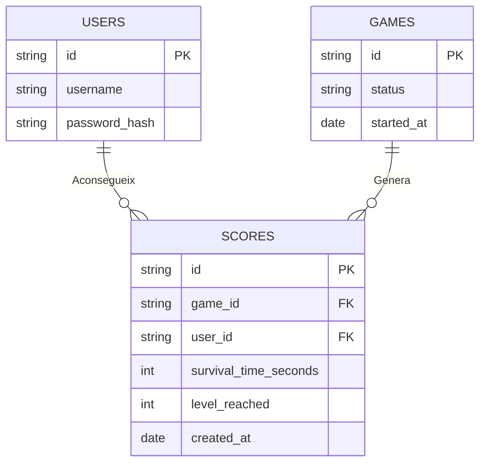
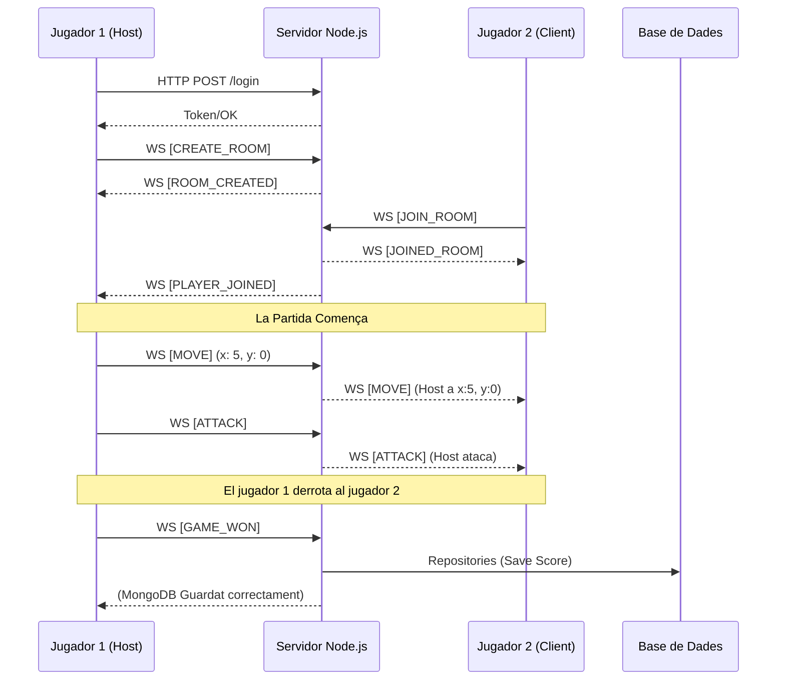
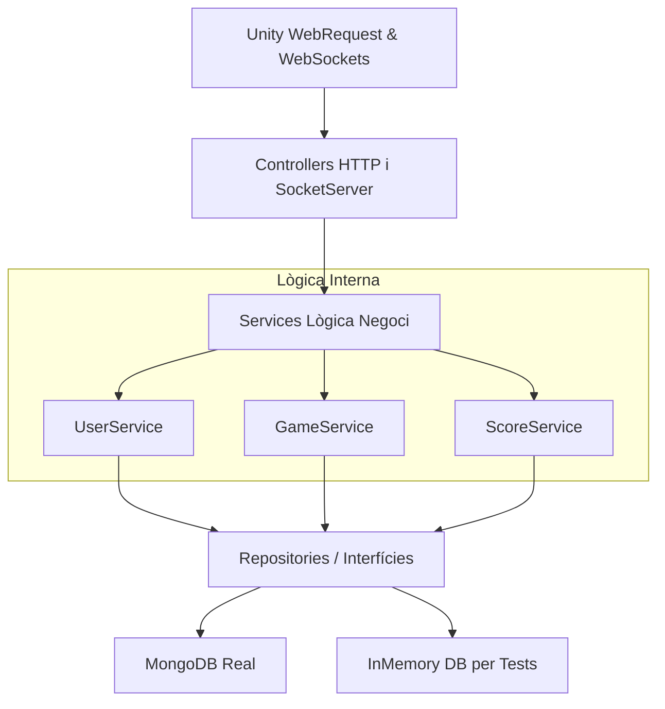

# Diagrames del Projecte

A continuació es presenten els diagrames requerits per a la documentació del projecte. Utilitzem format *Mermaid* perquè Github els pugui renderitzar automàticament de forma visual.

## 1. Diagrama de Casos d'Ús

Aquest diagrama mostra les accions principals que pot fer el jugador dins del joc.

```mermaid
usecaseDiagram
    actor Jugador

    package "Videojoc Survivor" {
        usecase "Registrar-se / Fer Login" as UC1
        usecase "Crear una Sala" as UC2
        usecase "Unir-se a una Sala" as UC3
        usecase "Moure el personatge" as UC4
        usecase "Atacar" as UC5
        usecase "Guardar Resultats al guanyar" as UC6
    }

    Jugador --> UC1
    Jugador --> UC2
    Jugador --> UC3
    Jugador --> UC4
    Jugador --> UC5
    UC5 --> UC6 : En cas de victòria
```

---

## 2. Diagrama Entitat-Relació (ERD)

Aquest diagrama mostra l'estructura simplificada de la base de dades MongoDB.



---

## 3. Diagrama de Seqüència (Sincronització WebSocket)

Aquest diagrama mostra com un jugador s'uneix i comença a interactuar a través de WebSockets, complint amb el requisit de mostrar la comunicació en temps real.



---

## 4. Arquitectura i Microserveis

Esquema de com està dividit el backend seguint Arquitectura Hexagonal.


